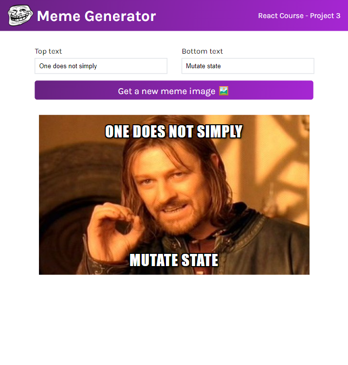

# Meme Generator - Learn React Project from Scrimba

This is a project for the 'Learn React' course from Scrimba.

### Screenshot

### Links

- Live Site URL: [https://cl4ram-meme-generator.netlify.app/](https://cl4ram-meme-generator.netlify.app/)

### My process

- useState and useEffect
- Conditional rendering
- Forms
